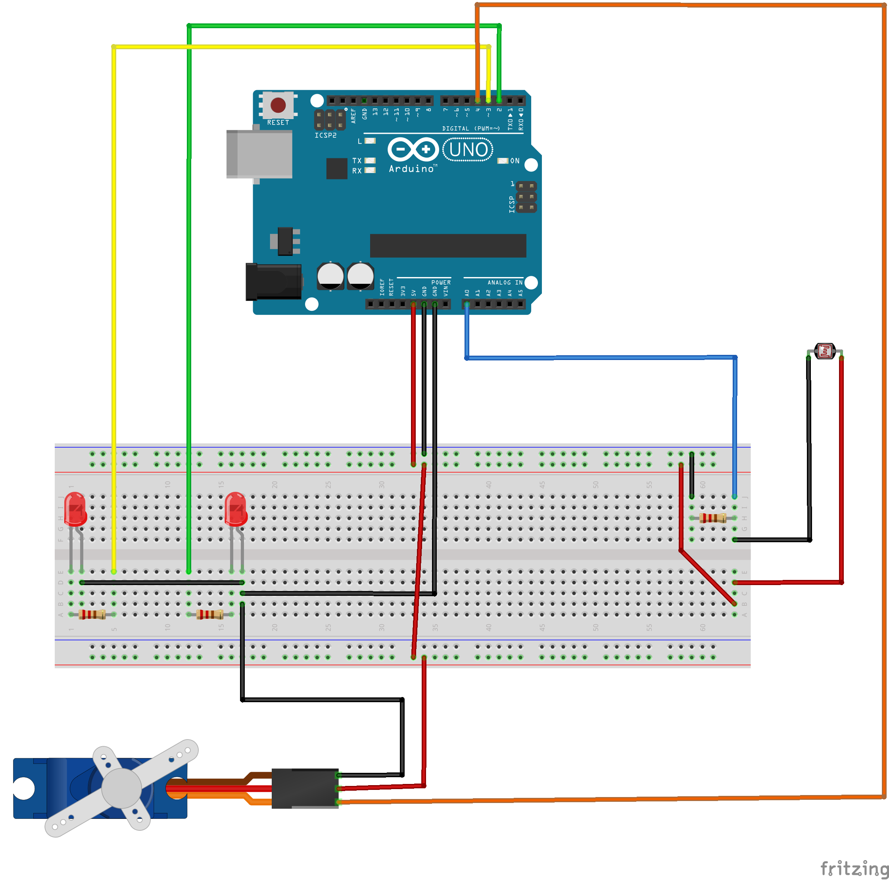
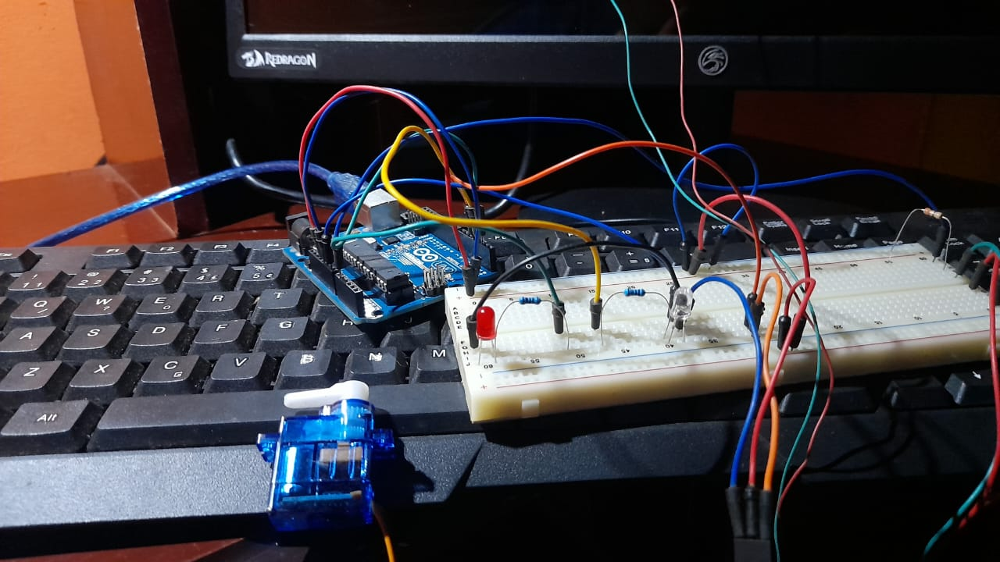

# Criação do circuito no arduino
<h3>Componentes necessários</h3>
Arduino Uno ou qualquer outro microcontrolador 1 Breadboard Jumpers/Cabos para conexão 1 Ldr 3 Resistors de 220 ohms 1 Micro Servo 9g SG90 2 Leds
 Link para IDE: https://docs.arduino.cc/software/ide-v1

  

